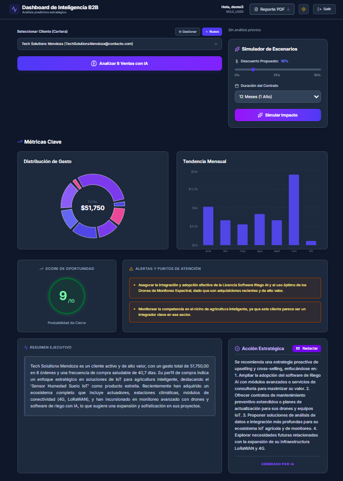
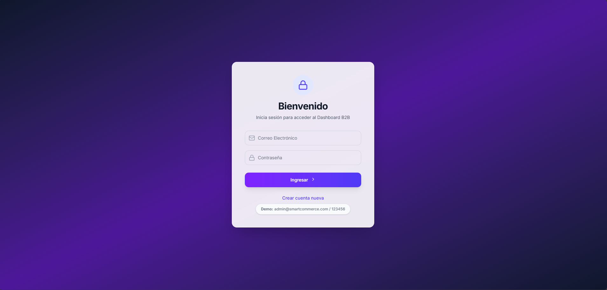
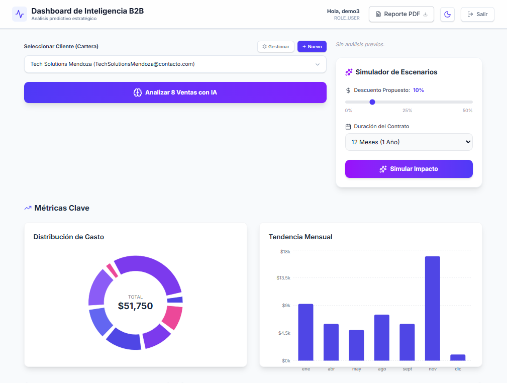
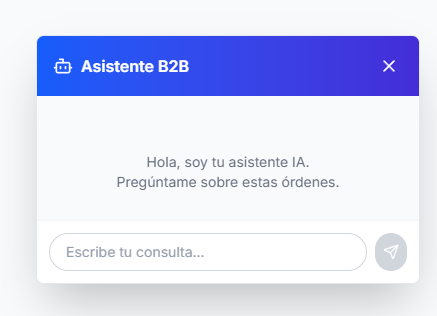
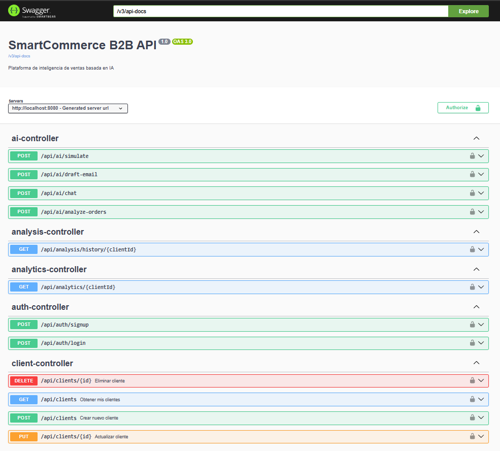

# SmartCommerce B2B - Intelligent Sales Platform


> **Plataforma de inteligencia comercial B2B potenciada por IA Generativa.**



## 📖 Descripción

**SmartCommerce B2B** es una solución empresarial diseñada para optimizar procesos comerciales complejos. A diferencia de un CRM tradicional, utiliza **Inteligencia Artificial (Google Gemini)** para analizar historiales de venta y sugerir estrategias activas de *Cross-selling* y *Upselling*.

Incluye un **Asistente Virtual RAG** (Retrieval-Augmented Generation) que permite a los vendedores "chatear" con sus datos para obtener insights instantáneos.

## 🚀 Características Clave

* 🤖 **IA Generativa & RAG:** Asistente inteligente para consultas en lenguaje natural sobre datos del negocio.
* 📧 **Redacción Automática:** Generación de correos de venta contextuales listos para enviar.
* 🏢 **Arquitectura Multi-tenant:** Aislamiento lógico de datos por organización/vendedor.
* 📊 **Dashboard Interactivo:** Visualización de KPIs con gráficos dinámicos y **Modo Oscuro** nativo.
* 🛡️ **Seguridad:** Autenticación robusta vía Spring Security + JWT.

## 📸 Galería del Proyecto

| **Login Seguro** | **Dashboard General** |
|:---:|:---:|
|  |  |

| **Asistente IA (Chat)** | **Redacción de Correos** |
|:---:|:---:|
|  |  |

| **Documentación API** | **Gestión de Datos** |
|:---:|:---:|
|  |  |

## 🛠️ Stack Tecnológico

* **Backend:** Java 21, Spring Boot 3.2, Spring Cloud OpenFeign.
* **Frontend:** React 18, TypeScript, Tailwind CSS, Recharts.
* **Datos:** PostgreSQL 16, Flyway Migration.
* **IA:** Google Gemini Pro API.
* **DevOps:** Docker Ready, Maven.

## 💻 Instalación Local

1.  **Clonar el repositorio:**
    ```bash
    git clone [https://github.com/TiagoFrencia/smartcommerce-b2b.git](https://github.com/TiagoFrencia/smartcommerce-b2b.git)
    ```

2.  **Configuración Backend:**
    * Navega a `backend/src/main/resources/`.
    * Renombra `application.properties.example` a `application.properties`.
    * Agrega tu `GEMINI_API_KEY` y credenciales de PostgreSQL.

3.  **Iniciar Backend:**
    ```bash
    ./mvnw spring-boot:run
    ```

4.  **Iniciar Frontend:**
    ```bash
    cd frontend
    npm install
    npm run dev
    ```

## 📄 Licencia

Este proyecto está bajo la Licencia MIT - ver el archivo [LICENSE](LICENSE) para más detalles.

---
**Autor:** Tiago Frencia
[![GitHub]](https://github.com/TiagoFrencia)
[]